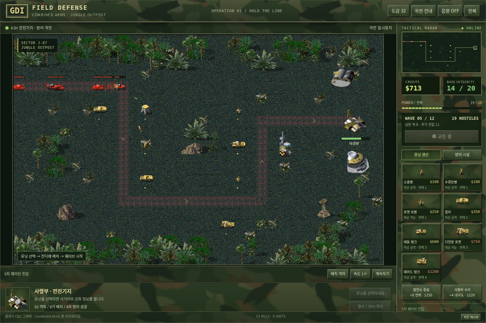
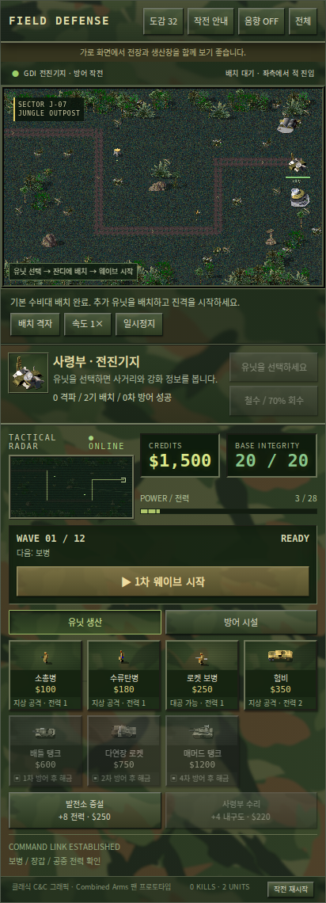

# C&C Field Defense — Jungle Outpost

클래식 C&C 유닛·지형과 흐릿한 **Woodland Camo UI**를 사용한 타워디펜스 팬 프로토타입입니다.
브라우저에서 플레이할 수 있고, 안드로이드 WebView 앱으로 이어서 개발할 수 있는 소스를 포함합니다.



> 상태: **v0.2.1 프로토타입** · 오르카 경로 수정 포함 · 설치용 APK는 아직 빌드하지 않았습니다.

## 실행

[`index.html`](index.html)을 다운로드한 뒤 브라우저로 여세요. 이미지·폰트·게임 코드가 포함되어 있어 별도 설치나 서버 없이 실행할 수 있습니다.
GitHub의 파일 보기 화면에서는 게임이 실행되지 않습니다.

1. 생산창에서 유닛을 선택합니다.
2. 흙길 주변 잔디를 눌러 배치합니다.
3. **웨이브 시작**을 누르면 자동으로 조준·공격합니다.
4. 배치한 유닛을 선택해 강화하거나 철수합니다.

기본 수비대 2기와 $1500으로 시작합니다. 4차부터 등장하는 공중 적에는 로켓 보병 등 대공 유닛을 준비하세요.

## 현재 기능

| 구분 | 구현 내용 |
| --- | --- |
| 그래픽 | CAmod에서 추출한 실제 유닛·건물·잔디·흙길·나무·바위 |
| UI | 흐릿한 우드랜드 카모, 금속 테두리, 우측 생산창, 레이더 |
| 편성 | 보병·차량·방어시설 10종 배치 / 도감 32종 |
| 전투 | 자동 표적 선택, 보병 애니메이션, 차체·포탑 분리, 탄환·폭발·레이저 |
| 웨이브 | 총 12차, 보병·차량·중장갑·공중 적, 최종 지휘 전차 |
| 성장 | 처치·방어 보상, Lv.3까지 강화, 투자금 70% 철수 환급 |
| 기지 | 전력 제한·발전소 증설·사령부 수리 |
| 조작 | 마우스·터치, 사거리·격자, 일시정지, 2배속, 합성 효과음 |

### 오르카 경로 수정 — v0.2.1

공중 적에 사용하던 별도 직선 경로를 제거했습니다. 이제 **오르카도 지상 적과 같은 진입점·굽은 경로·도착점**을 따라갑니다. 비행 표시, 이동 속도와 대공 공격 판정은 유지합니다.

### 모바일 화면



세로 화면에서는 생산창이 전장 아래에 표시됩니다. 가로 화면에서는 우측에 표시되며, 화면 높이가 작으면 생산창 내부를 스크롤할 수 있습니다.

## 편성 가능한 10종

소총병 · 수류탄병 · 로켓 보병 · 험비 · 배틀 탱크 · 다연장 로켓 · 매머드 탱크 · 가드 타워 · 고급 가드 타워 · 오벨리스크

완료한 웨이브에 따라 고급 유닛이 해금됩니다. 도감의 나머지 유닛은 후속 확장 후보입니다.

## 개발

- `web/engine.js` — 전투 규칙, 표적·피해 판정, 이동 경로와 웨이브
- `web/app.js` — Canvas 렌더링, 터치·마우스 조작과 UI
- `web/template.html` — 화면 구조와 스타일
- `assets.json` — 추출한 스프라이트, 지형과 도감 정보
- `web/woodland-camo.svg` — 이 프로젝트에서 만든 UI 위장무늬
- `build.py` — 단일 HTML 생성
- `android/` — WebView 안드로이드 앱 소스
- `upstream-notices/` — 원본 프로젝트의 저작자·라이선스 문서

Python 3으로 실행 파일을 다시 만듭니다.

```sh
python build.py
```

전투 규칙과 공중 유닛 경로 검증에는 Node.js를 사용합니다.

```sh
node tests/engine.cjs
node tests/air-route.cjs
```

브라우저 UI 검증에는 Playwright와 Chromium이 필요합니다. `tests/browser.cjs`의 `CHROMIUM_EXECUTABLE` 환경변수로 브라우저 경로를 지정할 수 있습니다.

안드로이드 빌드 준비와 자세한 설명은 [README_KO.md](README_KO.md)를 참고하세요. 이 버전에는 실제 기기 테스트 결과와 APK가 없습니다.

## 검증과 제한

- Chromium에서 배치·강화·철수·자동 전투·일시정지·도감·모바일 터치 확인.
- 세로/가로 화면 가로넘침 및 JavaScript 오류 검사.
- 전투 시뮬레이션으로 승리·패배 및 12차 클리어 확인.
- 오르카의 전체 굽은 경로 이동과 대공 표적 제한을 별도 회귀 검사.
- 진행 저장은 아직 없으며 새로고침하면 초기화됩니다.
- 리마스터 HD 그래픽이나 원작 게임 엔진이 아닙니다. 수치·UI·공격 효과·합성 사운드는 이 프로토타입용입니다.

## 라이선스와 출처

**프로젝트의 신규 소스 코드는 GPL-3.0-or-later로 제공합니다.** 전체 조건은 [LICENSE](LICENSE)에 있습니다. 이 라이선스 선언은 제3자 그래픽·폰트·상표의 권리를 변경하지 않습니다.

| 구성 요소 | 출처 / 적용 범위 |
| --- | --- |
| 게임 소스·UI·빌드/검증 코드 | 본 프로젝트 신규 코드, GPL-3.0-or-later |
| 유닛·건물·지형·팔레트 및 도감 데이터 | [Inq8/CAmod](https://github.com/Inq8/CAmod), 원본 저작자 권리 유지 |
| 포맷 처리 참고 | [OpenRA](https://github.com/OpenRA/OpenRA), GPL v3 계열; 전체 엔진을 이 게임에 포함한 것은 아님 |
| 한글 글꼴 | Noto Sans CJK KR 서브셋, SIL Open Font License 1.1 |

**게임 그래픽은 소스 코드와 구분됩니다.** [OpenRA 공식 안내](https://www.openra.net/legal/)는 원작 게임 에셋이 GPL에 포함되지 않으며 Electronic Arts의 자산이라고 설명합니다. CAmod 고유·수정 그래픽의 개별 권리도 원작자에게 남습니다. 이 저장소에 포함되었다는 이유만으로 그래픽의 자유로운 재배포나 상업적 사용 권한을 부여하지 않습니다.

정확한 추출 리비전, 변경 내용, 원본 문서는 [THIRD_PARTY_NOTICES.md](THIRD_PARTY_NOTICES.md)와 [provenance.json](provenance.json)에 정리했습니다.

Command & Conquer 및 관련 명칭은 Electronic Arts의 상표입니다. 이 프로젝트는 EA·OpenRA·Combined Arms의 공식 제품이 아니며 해당 주체의 후원·승인을 받았다는 의미가 아닙니다.
