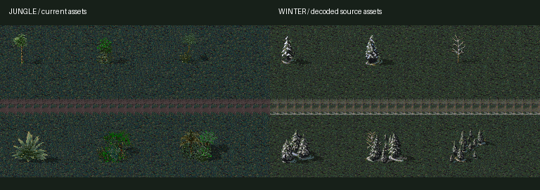

# 전장 테마 변경 검토

검토일: 2026-10-04. 게임 적용 전 기술 검토이며 공개 배포 권한 검토와는 별개입니다.

## 결론

현재 지도 생성·충돌·유닛 이동 구조를 유지하면서 전장 타일 묶음을 교체할 수 있습니다. Jungle 다음으로 Winter가 가장 적은 작업으로 연결 가능합니다. 단, 확인한 Winter는 **어두운 땅과 눈 묻은 나무**이고, 바닥 전체가 흰 Snow와는 별도 타일셋입니다.

| 전장 | 확인 결과 | 적용 판단 |
| --- | --- | --- |
| Jungle | 현재 구현된 바닥·길·수목 | 유지 |
| Winter | 기본 바닥 16종, 길 d03, 지면 패치 p01~p04, 수목 6종과 전용 팔레트 디코딩 성공 | 우선 적용 가능 |
| Barren | 위와 같은 이름의 기본 타일·수목과 전용 팔레트가 소스 트리에 있음 | 다음 후보, 아직 디코딩/화면 확인 전 |
| Snow | 추가 타일은 있으나 현재 방식에 필요한 기본 바닥·길 및 snow.pal을 해당 폴더에서 확보하지 못함; mod.yaml이 snow.mix 참조 | 추가 데이터 확인 필요 |
| Desert | 추가 타일·수목은 있으나 현재 추출기와 같은 기본 파일 묶음이 아님; desert.mix와 desert.pal 의존 | 추가 추출·타일 대응 작업 필요 |

## 실제 확인

CAmod 리비전 `b67e287461c4e1086a3ba46d8c0dcb1bb4dd6748` 기준입니다.

- Winter `clear1.win`: 24×24 픽셀, 변형 16종.
- Winter `d03.win`: 24×48 픽셀. 현재 길 추출 위치에 대응하는 자료가 있음. 연결부의 게임 화면 검증은 별도 필요.
- Winter `t01/t02/t03`: 48×48 픽셀, `tc01/tc02/tc03`: 72×48 픽셀. 현재 Jungle 수목과 크기가 같음.
- Winter `winter.pal`: 768바이트. `rules/palettes.yaml`의 WINTER terrain 설정과 일치.
- 현재 사용하는 `rock1/2/3`의 Winter 대응 파일은 없음. 초기 Winter 구성에서 바위는 제외하고 수목으로 구성할 수 있음.
- 아래 이미지는 원본 파일을 디코딩해 배치한 비교판이며 실행 중인 게임 스크린샷이 아님.

## 적용 설계

1. `make_terrain.py`를 테마별 폴더·확장자·팔레트를 받도록 일반화하고 `terrain-pack.json`을 테마별 묶음으로 구성.
2. 작전 시작 화면에 정글 / 겨울 / 무작위 선택 추가. 활성 테마에 맞춰 바닥·길·장식만 교체하고 유닛 그림과 Woodland Camo UI는 유지.
3. `web/app.js`에서 활성 테마의 이미지를 먼저 로딩하고 `Battlefields.create(seed, pack)`에 전달. 미니맵은 같은 전장 캔버스를 사용하므로 함께 갱신.
4. 전장 테마 변경은 새 작전 시작 때 반영. 진행 중 웨이브에서 경로를 바꾸면 배치·진행도가 충돌하므로 즉시 변경하지 않음.
5. Winter는 같은 수목 규격이므로 기존 경로 주변 여백 계산을 재사용 가능. 테마마다 기본 수비대 배치 가능 여부, 길 연결부, 오르카 경로와 모바일 가독성을 확인.

후속 작업: v0.3.1에 정글·겨울·무작위 선택을 연결했습니다. 정글·겨울 각각 2,000개 지도 및 20개 전체 오르카 경로 검사를 통과했습니다.

## 출처

- [Winter tileset](https://github.com/Inq8/CAmod/blob/b67e287461c4e1086a3ba46d8c0dcb1bb4dd6748/mods/ca/tilesets/winter.yaml)
- [Winter assets](https://github.com/Inq8/CAmod/tree/b67e287461c4e1086a3ba46d8c0dcb1bb4dd6748/mods/ca/bits/winter)
- [Palette configuration](https://github.com/Inq8/CAmod/blob/b67e287461c4e1086a3ba46d8c0dcb1bb4dd6748/mods/ca/rules/palettes.yaml)
- [Asset package configuration](https://github.com/Inq8/CAmod/blob/b67e287461c4e1086a3ba46d8c0dcb1bb4dd6748/mods/ca/mod.yaml)

원본 및 변형 에셋의 권리는 원권리자에게 있습니다. 기술적으로 읽을 수 있다는 결과가 공개 재배포 권한을 확인했다는 의미는 아닙니다. [공개 배포 검토](../PUBLICATION_REVIEW_KO.md) 참조.
